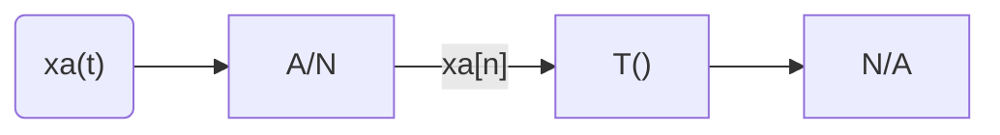

<h5 style="text-align: center"> TRAITEMENT DU SIGNAL NUMERIQUE </h5>

------

## **Contexte**

------

### Signaux et systèmes numériques

------

<table width="90%">
<tr>
<td style="width: 30%; text-align: left; background:transparent; border:0;">Matière</td>
<td style="width: 30%; text-align: center; background:transparent; border:0;">Alexis Bagarre</td>
<td style="width: 30%; text-align: right; background:transparent; border:0;">T1 - 2018 / 2019</td>
</tr>
</table>